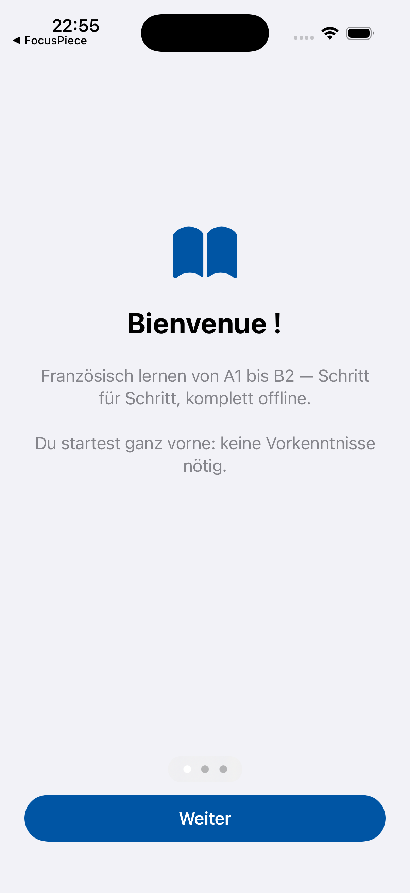
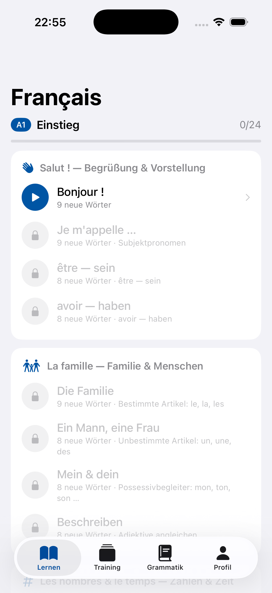

# Français — Französisch lernen A1–B2 (iOS)

Native iOS-App zum Französischlernen für deutschsprachige Anfänger:innen.
Offline-first, **ohne Streaks**, **ohne Audio**, mit **Grammatik-Engine** und
**Vokabeltrainer mit Spaced Repetition (SM-2)**. Lernrichtung Deutsch → Französisch.

Vollständige Spezifikation: [`docs/SPEC.md`](docs/SPEC.md)

<p>
  
  
</p>

## Status: Phase 3 — kompletter Lernpfad A1 → B2 ✅

**Phase 1 (A1-MVP):**
- ✅ CEFR-Lernpfad A1 mit 6 Einheiten / 24 Lektionen, sequenzielle Freischaltung
- ✅ Übungstypen: Multiple Choice, Matching, Lückentext (Cloze), Konjugation, Satzbau (Wörter ordnen), Satz-MC
- ✅ SM-2 Spaced Repetition (Start-EF 2.5, Untergrenze 1.3, Buttons „Nochmal/Schwer/Gut/Einfach")
- ✅ Regelbasierter Konjugator (1./2. Gruppe generiert, 3. Gruppe aus eigener Ausnahmentabelle)
- ✅ Personalisierte Fehlerwiederholung (falsche Antworten setzen den SRS-Zustand zurück, „Fehler üben"-Modus)
- ✅ Profil/Statistik ohne Streaks, Einstellungen mit Tagespensum, Datenexport, Reset

**Phase 2 (A2-Ausbau):**
- ✅ A2-Lernpfad: 6 weitere Einheiten / 24 Lektionen (Wohnen, Einkaufen, Gesundheit, Freizeit, Reise, Arbeit)
- ✅ Engine-Ausbau: **Imparfait** (nous-Stamm + Orthografie: mangions/commencions), **Futur simple**
  (inkl. unregelmäßiger Stämme ser-/aur-/ir-/fer-/viendr-/pourr-/voudr-/devr-/verr-),
  **Passé composé mit être** (+ Angleichung, alle Varianten werden akzeptiert),
  **Reflexivverben** (me/te/se mit Elision), y→i-Verben (payer)
- ✅ Neue Übungstypen: **Übersetzung DE→FR** (Freitext mit Alternativantworten), **Fehlerkorrektur**
- ✅ Grammatik: 32 Themen gesamt (u. a. COD/COI-Pronomen, en/y, Relativsätze, si + Präsens, Komparativ)
- ✅ Review-Log pro Bewertung (Statistik + Grundlage für spätere FSRS-Migration)
- ✅ Profil: 7-Tage-Fälligkeitsprognose, Trainings-Aktivität, Wörter nach Niveau

**Phase 3 (B1/B2-Vollausbau):**
- ✅ B1-Lernpfad: Meinung/Subjonctif, Beruf/Conditionnel, Erinnerungen/Plus-que-parfait,
  Medien/indirekte Rede, Umwelt/dont, Erfahrungen (24 Lektionen)
- ✅ B2-Lernpfad: Subjonctif vertieft (Konjunktionen, vs. Indicatif), Futur antérieur,
  Infinitif passé, Passé simple (Erkennung), Angleichung komplett (avoir-COD, Reflexive),
  faire causatif, Konnektoren, Fachsprache, faux amis, Idiomatik (24 Lektionen)
- ✅ Engine-Vollausbau: **Subjonctif présent** (ils-Stamm + Imparfait-nous/vous, Sonderformen
  sois/aie/aille/fasse/puisse/veuille/sache), **Conditionnel présent/passé**,
  **Plus-que-parfait**, **Futur antérieur**, **reflexives Passé composé** (je me suis levé)
  — Angleichung in allen être-Zeiten, alle Varianten werden als Antwort akzeptiert
- ✅ `tools/validate_content.py`: Content-Validierung ohne Xcode (für CI/pre-commit)

**Inhalt gesamt:** 590 Vokabeln · 107 Verben · 61 Grammatikthemen · 96 Lektionen (24 je Niveau) · ~1200 Übungen

### Bewusst verschoben (Phase 4 / optional)

- **FSRS**: Die Spec nennt als Benchmark-Schwelle „>1000 aktive Karten" — darunter ist der
  Effizienzgewinn die Zusatzkomplexität nicht wert. Die nötige Reviewhistorie wird seit
  Phase 2 vollständig geloggt (`ReviewLogEntry`), die Migration ist also jederzeit möglich.
- **iCloud-Sync**: SwiftData + CloudKit verbietet Unique-Constraints (`ReviewState.vocabID`)
  und verlangt Defaults für alle Attribute — braucht ein eigenes Schema-Redesign.
- **Datenpipeline** (Lexique/DBnary/Tatoeba): lohnt ab redaktioneller Skalierung über
  das aktuelle, selbst verfasste Inventar hinaus; Lizenz-Attributionen dann in den Credits.

## Build

Voraussetzungen: Xcode 16+ (getestet mit Xcode 26.3), [XcodeGen](https://github.com/yonaskolb/XcodeGen) (`brew install xcodegen`).

```bash
xcodegen generate
open FrenchApp.xcodeproj        # Scheme „FrenchApp", iOS-17-Simulator
```

Tests (SM-2, Konjugator, Content-Validierung):

```bash
xcodebuild test -scheme FrenchApp -destination 'platform=iOS Simulator,name=iPhone 17 Pro'
```

Die `.xcodeproj` ist bewusst nicht eingecheckt — Quelle der Wahrheit ist `project.yml`.

## Architektur

| Schicht | Technologie | Anmerkung |
|---|---|---|
| UI | SwiftUI, iOS 17+ | Tabs: Lernen (Pfad) · Training (SRS) · Grammatik · Profil |
| Nutzerdaten | SwiftData | `ReviewState` (SM-2), `LessonProgress`, `MistakeRecord`, `UserSettings` |
| Inhalte | Gebündeltes JSON, read-only | `Resources/Content/` — Vokabeln, Verben, Grammatik, Kursplan |
| Grammatik-Engine | `Conjugator` + deklarative `GrammarRule`-Daten | rein regelbasiert, keine Fremddaten |
| SRS | `SM2.swift` (pure function) + `SRSService` | kanonisches SM-2 nach Woźniak 1987 |

### Bewusste Abweichungen von der Spec (mit Begründung)

1. **JSON statt GRDB/SQLite für Inhalte.** Die Spec empfiehlt read-only SQLite via GRDB,
   erlaubt aber ausdrücklich „vorverarbeitetes JSON" als Alternative. Beim aktuellen
   Umfang (~200 Vokabeln, 24 Lektionen) ist gebündeltes JSON ohne Fremd-Dependency die
   einfachere, ebenso offline-fähige Lösung. `ContentStore` kapselt den Zugriff —
   ein späterer Wechsel auf GRDB betrifft nur diese eine Klasse.
2. **Konjugationen zur Laufzeit statt vorgeneriert.** Der regelbasierte Konjugator *ist*
   die in der Spec beschriebene Grammatik-Engine (Stamm + Endung, Orthografie-Regeln
   für -ger/-cer/è-Stammwechsel/Konsonantverdopplung, Ausnahmentabelle). Er ist
   deterministisch und durch Unit-Tests abgedeckt — Vorgenerierung wäre nur ein Cache.
3. **Kein `GrammarProgress`-Modell.** Grammatik-Status wird aus abgeschlossenen
   Lektionen abgeleitet (Regeln sind mit Lektionen verknüpft) — kein duplizierter Zustand.
4. **„Ziel-Retention" fehlt in den Einstellungen.** Das ist ein FSRS-Parameter; SM-2
   kennt ihn nicht. Kommt mit dem optionalen FSRS-Upgrade in Phase 3.

### SM-2-Mapping der Bewertungsbuttons

| Button | q | Wirkung |
|---|---|---|
| Nochmal | 2 | Wiederholungen → 0, Intervall 1 Tag, Karte kommt in der Session erneut |
| Schwer | 3 | korrekt, EF −0.14 |
| Gut | 4 | korrekt, EF unverändert |
| Einfach | 5 | korrekt, EF +0.10 |

Fehler in Lektionsübungen setzen den SRS-Zustand des betroffenen Worts zurück
(Intervall 0, sofort fällig) — die personalisierte Fehlerwiederholung aus der Spec.

## Inhalte & Lizenzen

Alle Lerninhalte (Vokabelauswahl, deutsche Erklärungen, Beispielsätze, Übungen,
Konjugationstabellen) sind **redaktionell selbst erstellt**. Es wurden bewusst
**keine Verbiste-abgeleiteten Konjugationsdaten** verwendet (GPL-Copyleft, siehe
SPEC Abschnitt 5). Die 3-Gruppen-Konjugationsregeln des Französischen sind Gemeingut.

Geplante Datenpipeline für Phase 2 (Lexique-Frequenzen CC BY-SA, DBnary CC BY-SA,
kuratierte Tatoeba-Sätze CC BY): siehe SPEC, Abschnitt „Datenquellen-Strategie".

## Roadmap

Der Spec-Umfang (Phase 1–3) ist umgesetzt. Mögliche nächste Schritte:

- **Phase 4 (optional):** FSRS als Opt-in mit Ziel-Retention (Review-Log liegt vor),
  iCloud-Sync (Schema-Redesign nötig), Datenpipeline Lexique/DBnary/Tatoeba,
  UI-Tests (XCUITest), App-Store-Vorbereitung (Signing, Datenschutz, Screenshots)
